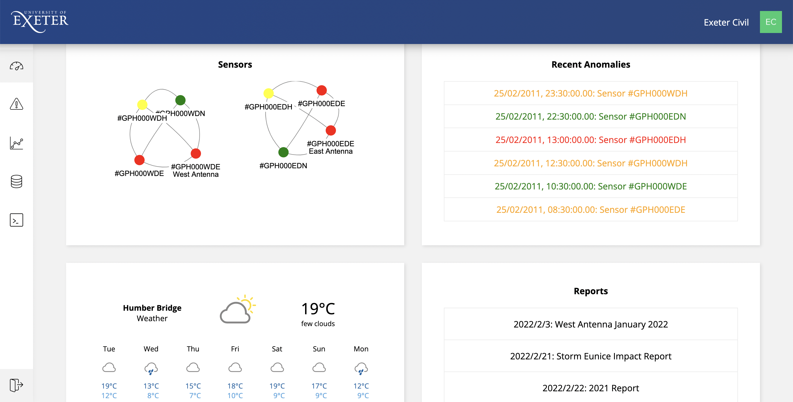
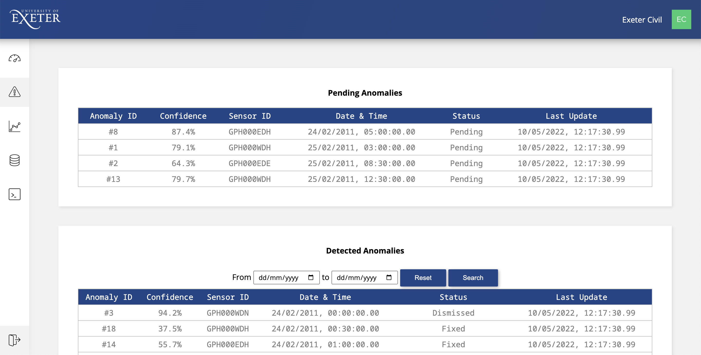
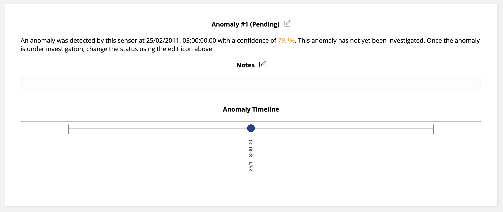
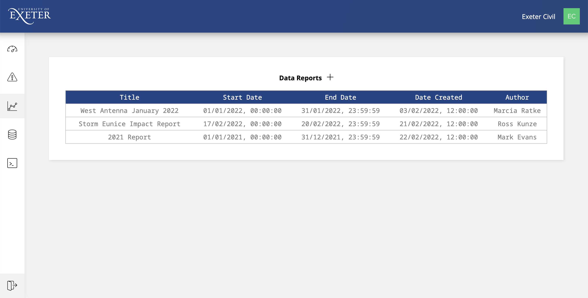
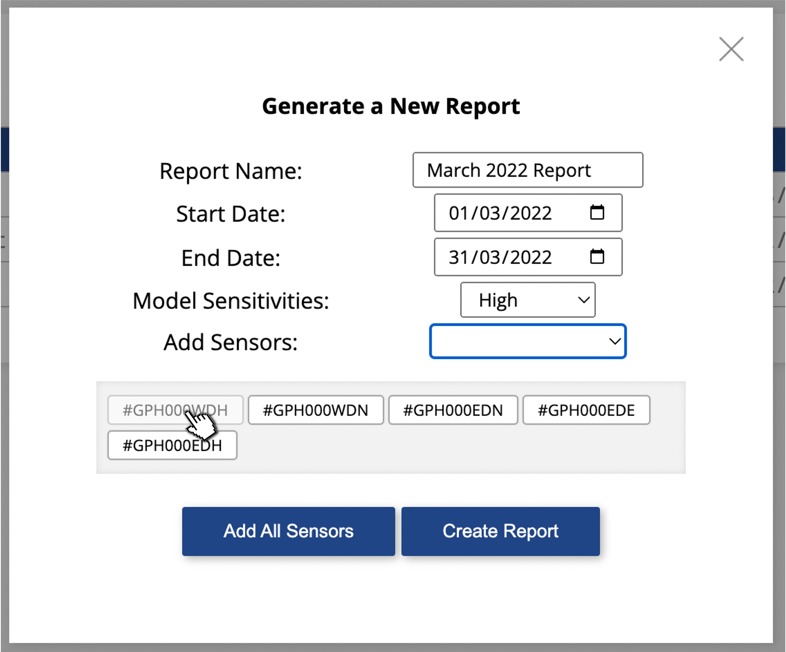
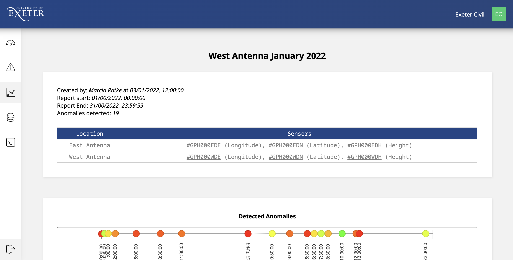

# User Guide

## Getting Started

Once logged in, the main navigation throughout the system starts with the dashboard, which shows an overview of some important aspects of the available data.

 

  

This includes tiles containing some of the most recent anomalies and reports, as well as a map of all sensors in the system, grouped together by their location. This diagram of sensors can also be used to further inspect sensors, which can be done by clicking on the node in the network diagram.

The sidebar to the left of the page contains links to all other pages within the system, specifically, the dashboard, the anomalies page, the reports page, the sensor database and the Jupyter Notebooks. The user and admin settings can also be reached by clicking on the profile name on the top right of the page.

The user settings page also allows the user to change their 'model sensitivity level,' which ranges from 'very high' to 'very low.' This setting does not affect the running of the time series or autoencoder models themselves, or the anomalies that they are able to detect, but does change the amount of anomalies that the user is notified of. The sensitivity can be turned down to see a larger amount of the detected anomalies, or can be turned up if too many anomalies are being displayed, which means some anomalies may be missed!

Other than the investigation of anomalies, reports and the jupyter notebooks, the sensor database page displays all the sensors currently being used by the system. Then, to inspect a sensor, click on the sensor row in the table. This will open the sensor page, which displays all information about the sensor, including:

- A diagram with connected sensors, specifically those in the same location as the selected sensor. This can also be used to travel to these other sensors, by clicking on the node.
- Graphs are displayed with the average daily values from the sensor over the past week and all values collected over the past 24 hours.
- A timeline, which shows all the anomalies detected by the sensor within the previous week.
- All data collected by the sensor, which can be searched through to find data from within a certain timeframe using the form above.
- Each sensor page also has a notes table, which allows the user to add comments to specific sensors. These comments can be added by clicking on the edit icon next to the title at the top of the notes tile.

Reports can be used to visualise data with more control over the data visualised, along with their ability to display the values from multiple sensors and investigate anomalies with different sensitivity levels.

## Investigating Anomalies

The SHM system is able to detect and store details of potential anomalies, which can then be later analysed by the user.

Anomalies can be accessed either through the recent anomalies tile on the system dashboard, which shows the 6 most recently detected anomalies, or through the anomalies icon in the sidebar.

 

  

Once on the anomalies page, pending anomalies, those that have not been investigated by any user, are displayed at the top of the page. The table below shows all other anomalies and can be used to search for those between certain dates with the form above.

Then, after an anomaly has been selected, details of the anomaly are displayed beneath the sensor data, including the time it occurred on this sensor, the model's confidence and the current status. This also displays a comments section and timeline of other anomalies that happened within 2 hours either side of the anomaly.

Anomaly statuses are initialised as 'pending,' which means that no user has begun to investigate the anomaly. Then, once they have been notified about the anomaly, the user can click on the edit button next to the anomaly title, which will give the option to change the anomaly status. Specifically, anomalies can either be changed to 'Under Investigation,' 'Urgent,' 'Fixed' or 'Dismissed.' If required, a note can also be added alongside the status change, which will be displayed in the comments section of the anomaly.

 

  

## Creating Reports

Reports can be used to analyse the data from specific sensors over a specific period of time. By creating a report, all relevant data and anomalies can be collected, saved and visualised in order to better analyse and monitor the structural health.

Similarly to anomalies, reports can either be accessed through the reports tile on the system dashboard, or from the reports page icon in the sidebar. The reports page will display all previous user-generated reports, including their title, their timeframe, the time they were created as well as their author.

 

  

New reports can be generated by clicking on the add icon next to the reports title, which will display the report creation form. Here, you can input the report title, timeframe, model sensitivities and sensors.

The model sensitivies affect both the time series and the autoencoder models and can be different to your own profile sensitivity settings. Sensors are added by ID and are grouped by location during selection. To add all sensors to the report, click the 'Add All Sensors' button and to remove a sensor from the list, click on its ID in the section below.

 

  

Once the report has been created, the system generates several visualisations of the data from the specified time period, mainly with a timeline of detected anomalies and graphs showing sensor data. Basic information about the report is also displayed at the top of the page, including the ID and type of all relevant sensors.

Anomalies can be further investigated by clicking on the node in the report's anomaly timeline.

 

  

## Jupyter Notebooks

The Jupyter Notebooks section can be accessed through the code icon in the main sidebar and allows the user to analyse and modify various parameters of both the time series and autoencoder models. By runnning the model through the Jupyter Notebooks using the instructions given, this will change the main model used throughout the whole system.

## Admin Settings

Admin users are able to manage all other user accounts in the system. This can be accessed from the user settings page, where there is a link to the relevant page underneath the user settings. To add a user, simply enter a name, email and password for the new account, and to delete an account, click on the account in the user table at the bottom of the page and then click 'OK'.
